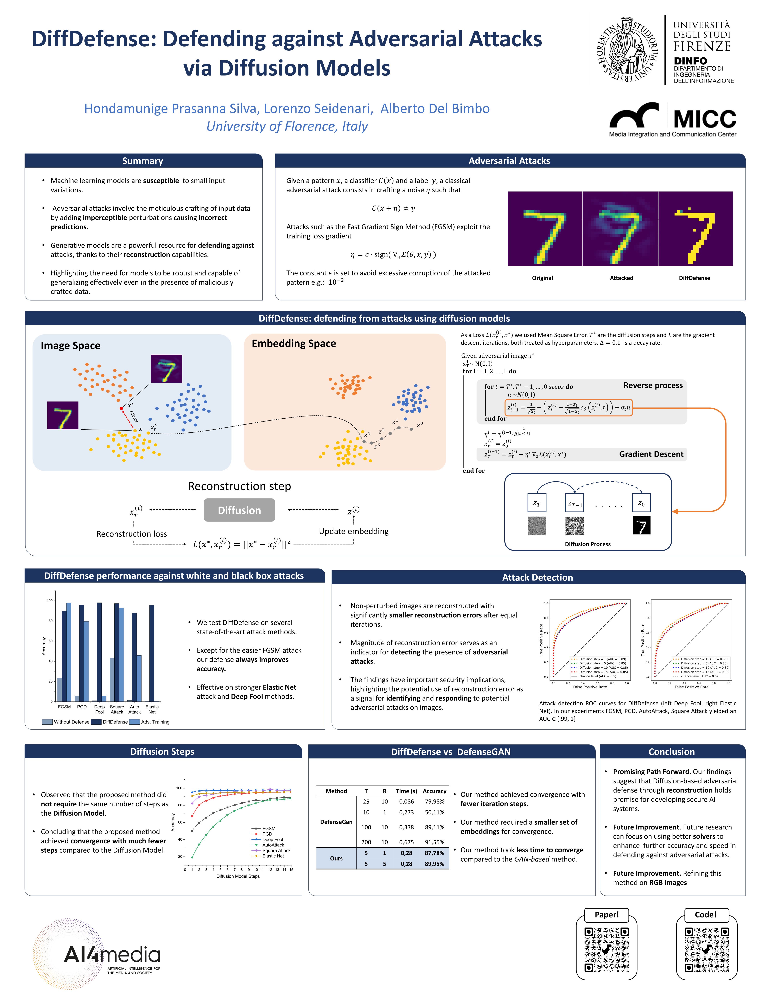
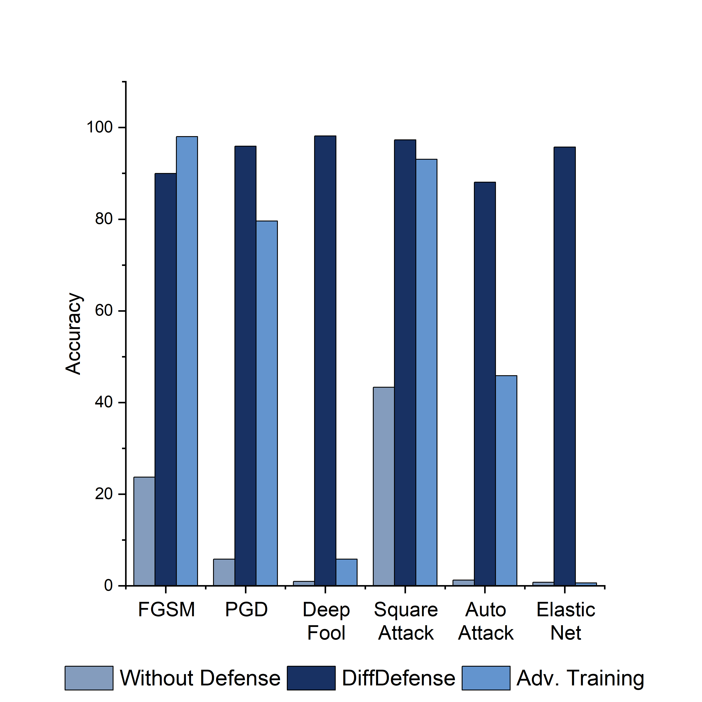
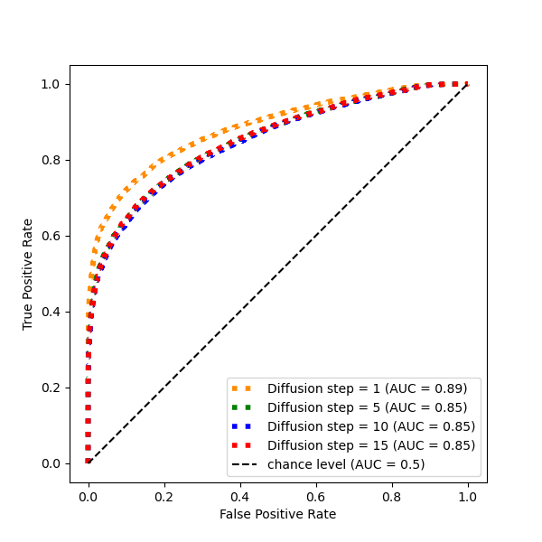
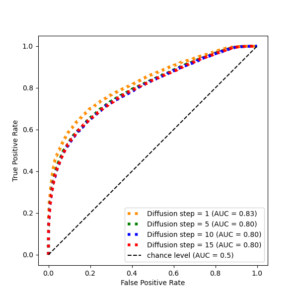

# DiffDefence: defending against adversarial attacks via diffusion models. [](https://arxiv.org/abs/2309.03702)

[](https://pytorch.org)


This is the official implementation of the paper DiffDefence, ICIAP 2023

Abstract: *This paper proposes a reconstruction method based on the diffusion model to defend machine learning classifiers against adversarial attacks without requiring any modifications to the classifiers themselves. The vulnerability of machine learning models to small input perturbations makes them susceptible to adversarial attacks. Although diffusion-based methods are typically not utilized in adversarial defense due to the slow reverse process, this paper shows that the proposed method provides similar robustness to other generative model-based solutions while maintaining a comparable speed.*


<p align="center">
  
</p>

## Poster 

<p align="center">
  
</p>

## Requirements

Before running the code, install conda, and requirements and activate the environment env
```
$ conda create --name env --file requirements.txt
$ conda activate env
```

# Test Instructions
Make sure to run the setup file to create all the necessary folders!
```
$python setup.py 
```

## Train the classifiers! 
First of all, you must train the classifiers to test diffDefence. The training can be logged with wandb, set --wandb='run' if you want to log. 
```
$python train.py --dataset='MNIST' --classifier='classifier_a' --model_title='c_a'
$python train.py --dataset='MNIST' --classifier='classifier_b' --model_title='c_b'
```

Tests presented in the paper use classifier_a as the main classifier and classifier_b as the substitute model to create adversarial images to attack classifier_a in the black box settings.
You must train both the classifier, and afterwards, you can choose what to use as the substitute model.

To train adversarial trained classifier, set --adv_train.
```
$python train.py --dataset='MNIST' --adv_train=True --classifier='classifier_a' --model_title='c_a_adv'
```
Check the train.py file to set other configuration parameters. 

## Train the Diffusion Model
Afterwards, train the Diffusion model. Check the DDPM.py file to set other configuration parameters.
```
$python DDPM.py --dataset='MNIST' --model_title='diff'
```
Samples images are saved on the imgs folder

## Test DiffDefence
Finally, test DiffDefence!

- White box attack setting
```
$python diffDefence.py --dataset='MNIST' --classifier='c_a' --typeA='classifier_a' --diffusion_name='diff' --test_size=1000
```

- Black box attack setting
```
$python diffDefence.py --dataset='MNIST' --classifier='c_a' --typeA='classifier_a' --sub_classifier='c_b' --typeB='classifier_b'  --diffusion_name='diff' --test_size=1000
```

 - If you want to test adversarial trained model against adversarial attacks
```
$python diffDefence.py --dataset='MNIST' --classifier='c_a_adv' --typeA='classifier_a' --diffusion_name='diff' --test_size=1000
```

# Experiments


## DiffDefense performance against white and black box attacks
<p align="center" >
  
</p>


## Attack Detection
<p align="center">
  
  
</p>

Attack detection ROC curves for DiffDefense (left Deep Fool, right Elastic Net). In our experiments FGSM, PGD, AutoAttack, Square Attack yielded an
AUC ∈ [.99, 1]

## Citation

If you use this codebase, or otherwise found our work valuable, please cite Mamba:
```
@inproceedings{silva2023diffdefense,
  title={DiffDefense: Defending Against Adversarial Attacks via Diffusion Models},
  author={Silva, Hondamunige Prasanna and Seidenari, Lorenzo and Del Bimbo, Alberto},
  booktitle={International Conference on Image Analysis and Processing},
  pages={430--442},
  year={2023},
  organization={Springer}
}

```